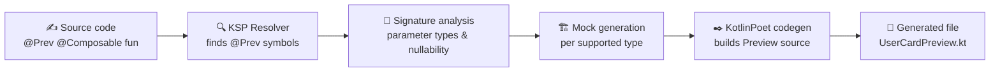

<div align="center">

<!-- Project banner/logo — drop an image at docs/images/banner.png (or .svg) and uncomment: -->
<!--  -->

# PrevHam

**Compile-time Jetpack Compose Preview & mock data generation, powered by KSP.**

Annotate a `@Composable` function with `@Prev` and let PrevHam generate the `@Preview` function and its mock arguments for you — no runtime reflection, no boilerplate.

[](https://github.com/parkjiminnnn/PrevHam/actions/workflows/ci.yml)
[](LICENSE)
[](https://kotlinlang.org)
[](https://github.com/google/ksp)

[Why PrevHam?](#-why-prevham) •
[Quick Start](#-quick-start) •
[How It Works](#-how-it-works) •
[Architecture](#-architecture) •
[Roadmap](#-roadmap)

</div>

---

## ✨ Features

| Feature | Description | Status |
|---|---|---|
| `@Prev` annotation | Single annotation to trigger Preview generation | ✅ Done |
| Automatic Preview generation | Generates a `@Preview @Composable` wrapper function via KotlinPoet | ✅ Done |
| Primitive & String mocks | Auto-generates mock values for `Int`, `String`, `Boolean`, etc. | ✅ Done |
| Data class mocks | Builds mock instances for flat data class parameters | ✅ Done |
| Nullable support | Uses a real mock when possible, falls back to `null` otherwise | ✅ Done |
| Collection support | Generates mock `List`, `Set`, `Map` values | ✅ Done |
| Enum support | Picks a valid mock value from enum constants | ✅ Done |
| Nested data classes | Recursive mock generation for nested object graphs | 🚧 Planned |
| Interface mocks | Generates interface mocks via MockK | 🚧 Planned |
| Preview options | Dark mode, locale, font scale variants | 🚧 Planned |

> **Legend** — ✅ In progress · 🚧 Planned · See the full [Roadmap](#-roadmap) for release-by-release detail.

---

## 🤔 Why PrevHam?

Writing a Compose Preview usually means hand-building mock data for every parameter, every time a screen changes. That's harmless for one screen — it stops being harmless once you have a hundred of them:

- 📝 Preview functions have to be written and kept in sync by hand
- 🧱 Mock objects are duplicated across previews
- 🔁 Every parameter change means updating the mock data too

**PrevHam removes that entire category of boilerplate.** It's a KSP `SymbolProcessor` that runs at compile time, reads your `@Composable` function's signature, and generates the Preview function and its mock arguments for you — deterministically, with zero runtime cost and zero reflection.

#### Before — written and maintained by hand

```kotlin
@Composable
fun UserCard(
    user: User,
    onClick: () -> Unit,
)

@Preview
@Composable
private fun UserCardPreview() {
    UserCard(
        user = User(id = 1, name = "John Doe", age = 20),
        onClick = {},
    )
}
```

#### After — generated by PrevHam at compile time

```kotlin
@Prev
@Composable
fun UserCard(
    user: User,
    onClick: () -> Unit,
)

// UserCardPreview.kt is generated automatically — nothing else to write.
```

---

## 🚀 Quick Start

> PrevHam isn't published to Maven Central yet (tracked in [Roadmap → v1.0](#-roadmap)). The coordinates below reflect the intended usage once it ships.

### 1. Apply the KSP plugin

```kotlin
// build.gradle.kts
plugins {
    id("com.google.devtools.ksp") version "<ksp-version>"
}
```

### 2. Add the dependencies

```kotlin
dependencies {
    implementation("io.github.parkjiminnnn:runtime:<version>")
    ksp("io.github.parkjiminnnn:compiler:<version>")
}
```

### 3. Annotate your composable

```kotlin
import io.github.parkjiminnnn.runtime.Prev

@Prev
@Composable
fun UserCard(
    user: User,
    onClick: () -> Unit,
) {
    // ...
}
```

### 4. Build

PrevHam generates the `@Preview` function during the KSP step of your normal Gradle build — no extra task to run.

```kotlin
@Preview
@Composable
private fun UserCardPreview() {
    UserCard(
        user = User(id = 1, name = "John Doe", age = 20),
        onClick = {},
    )
}
```

---

## ⚙️ How It Works

PrevHam runs entirely inside the Kotlin compilation pipeline via KSP — nothing happens at runtime.



1. **Resolve** — `PrevSymbolProcessor` asks the KSP `Resolver` for every symbol annotated with `@Prev`.
2. **Analyze** — each annotated function's parameter list is inspected: type, nullability, and shape (primitive, data class, collection, enum, interface).
3. **Generate mocks** — a dedicated mock generator produces a compile-time-safe value for each supported parameter type.
4. **Emit source** — [KotlinPoet](https://square.github.io/kotlinpoet/) assembles a new `@Preview @Composable` function that calls the original composable with the generated mocks.
5. **Compile** — the generated file is fed back into the same compilation unit, so the Preview is available immediately, with full IDE support.

---

## 🗺 Roadmap

### v0.1 — Foundation
- [x] `@Prev` annotation
- [x] Basic KSP `SymbolProcessor` structure
- [x] Automatic Preview generation
- [x] Primitive type support
- [x] String support
- [x] Data class mock generation

### v0.2 — Type coverage
- [x] Nullable type support
- [x] Enum support
- [x] Collection support
- [ ] Nested data class support

### v0.3 — Advanced types
- [ ] Function type support
- [ ] Interface mock generation (MockK)
- [ ] Generic type support

### v0.4 — Preview options
- [ ] Preview option support
- [ ] Dark mode Preview
- [ ] Locale Preview
- [ ] Font scale Preview

### v1.0 — Stable release
- [ ] Stable public API
- [ ] Publish to Maven Central
- [ ] Improved documentation
- [ ] Sample project polish

---


## 📄 License

PrevHam is licensed under the [Apache License 2.0](LICENSE).

```
Copyright 2026 parkjiminnnn

Licensed under the Apache License, Version 2.0 (the "License");
you may not use this file except in compliance with the License.
You may obtain a copy of the License at

    http://www.apache.org/licenses/LICENSE-2.0
```

<div align="center">

Built with ❤️ to make Compose Previews effortless.

</div>
