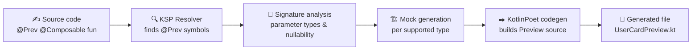

<div align="center">

# PrevHam

**Compile-time Jetpack Compose Preview & mock data generation, powered by KSP.**

Annotate a `@Composable` function with `@Prev` and let PrevHam generate the `@Preview` function and its mock arguments for you — no runtime reflection, no boilerplate.

[](https://central.sonatype.com/namespace/io.github.parkjiminnnn)
[](https://github.com/parkjiminnnn/PrevHam/actions/workflows/ci.yml)
[](LICENSE)
[](https://kotlinlang.org)
[](https://github.com/google/ksp)

[Why PrevHam?](#-why-prevham) •
[Quick Start](#-quick-start) •
[How It Works](#-how-it-works) •
[Docs](docs/architecture.md)

</div>

---

## ✨ Features

| Feature | Description |
|---|---|
| `@Prev` annotation | Single annotation to trigger Preview generation |
| Automatic Preview generation | Generates a `@Preview @Composable` wrapper function via KotlinPoet |
| Primitive & String mocks | Auto-generates mock values for `Int`, `String`, `Boolean`, etc. |
| Data class mocks | Builds mock instances for flat data class parameters |
| Nullable support | Uses a real mock when possible, falls back to `null` otherwise |
| Collection support | Generates mock `List`, `Set`, `Map` values |
| Enum support | Picks a valid mock value from enum constants |
| Nested data classes | Recursive mock generation for nested data classes and collections (depth-limited) |
| Interface mocks | Generates interface/non-data-class mocks via MockK (or a real instance, e.g. `Modifier`, when a self-implementing companion is available) |
| Function type mocks | Generates lambda literals for function-type parameters, mocking the return value for non-`Unit` types |
| Generic type support | Resolves type arguments for generic data classes and interfaces (e.g. `Box<String>`, `Repository<String>`) |
| Preview options | Dark mode, locale, font scale variants via `@Prev(darkMode, locales, fontScales)` |

> See [Releases](https://github.com/parkjiminnnn/PrevHam/releases) for what shipped in each version, and [open issues](https://github.com/parkjiminnnn/PrevHam/issues) for what's planned next.

---

## 🤔 Why PrevHam?

Writing a Compose Preview usually means hand-building mock data for every parameter, every time a screen changes. That's harmless for one screen — it stops being harmless once you have a hundred of them:

- 📝 Preview functions have to be written and kept in sync by hand
- 🧱 Mock objects are duplicated across previews
- 🔁 Every parameter change means updating the mock data too

**PrevHam removes that entire category of boilerplate.** It's a KSP `SymbolProcessor` that runs at compile time, reads your `@Composable` function's signature, and generates the Preview function and its mock arguments for you — deterministically, with zero runtime cost and zero reflection.

#### Before — written and maintained by hand

```kotlin
@Composable
fun UserCard(
    user: User,
    onClick: () -> Unit,
)

@Preview
@Composable
private fun UserCardPreview() {
    UserCard(
        user = User(id = 1, name = "John Doe", age = 20),
        onClick = {},
    )
}
```

#### After — generated by PrevHam at compile time

```kotlin
@Prev
@Composable
fun UserCard(
    user: User,
    onClick: () -> Unit,
)

// UserCardPreview.kt is generated automatically — nothing else to write.
```

---

## 🚀 Quick Start

> Published versions are listed on [Maven Central](https://central.sonatype.com/namespace/io.github.parkjiminnnn).

### 1. Apply the KSP plugin

```kotlin
// build.gradle.kts
plugins {
    id("com.google.devtools.ksp") version "2.2.10-2.0.2"
}
```

### 2. Add the dependencies

```kotlin
dependencies {
    implementation("io.github.parkjiminnnn:prevham-runtime:1.0.0")
    ksp("io.github.parkjiminnnn:prevham-compiler:1.0.0")

    // Required if any @Prev composable has an interface or non-data-class parameter
    // (e.g. Modifier) — PrevHam mocks those with MockK's mockk<T>(relaxed = true).
    // Not debugImplementation: KSP generates Previews for every variant, so the release
    // compilation needs MockK on its classpath too.
    implementation("io.mockk:mockk:1.13.13")
}
```

### 3. Annotate your composable

```kotlin
import io.github.parkjiminnnn.runtime.Prev

@Prev
@Composable
fun UserCard(
    user: User,
    onClick: () -> Unit,
) {
    // ...
}
```

### 4. Build

PrevHam generates the `@Preview` function during the KSP step of your normal Gradle build — no extra task to run.

```kotlin
@Preview
@Composable
private fun UserCardPreview() {
    UserCard(
        user = User(id = 1, name = "John Doe", age = 20),
        onClick = {},
    )
}
```

### 5. (Optional) Request Preview variants

`@Prev` accepts `darkMode`, `locales`, and `fontScales` to generate additional stacked `@Preview` annotations, alongside the default one.

```kotlin
@Prev(darkMode = true, locales = ["ko", "en"], fontScales = [0.85f, 1.5f])
@Composable
fun UserCard(user: User, onClick: () -> Unit) {
    // ...
}
```

```kotlin
@Preview
@Preview(name = "Dark Mode", uiMode = Configuration.UI_MODE_NIGHT_YES)
@Preview(name = "Locale: ko", locale = "ko")
@Preview(name = "Locale: en", locale = "en")
@Preview(name = "Font scale: 0.85x", fontScale = 0.85f)
@Preview(name = "Font scale: 1.5x", fontScale = 1.5f)
@Composable
private fun UserCardPreview() {
    UserCard(
        user = User(id = 1, name = "John Doe", age = 20),
        onClick = {},
    )
}
```

---

## ⚙️ How It Works

PrevHam runs entirely inside the Kotlin compilation pipeline via KSP — nothing happens at runtime.



1. **Resolve** — `PrevSymbolProcessor` asks the KSP `Resolver` for every symbol annotated with `@Prev`.
2. **Analyze** — each annotated function's parameter list is inspected: type, nullability, and shape (primitive, data class, collection, enum, interface). The `@Prev` annotation's own arguments (`darkMode`, `locales`, `fontScales`) are also read to determine which Preview variants to generate.
3. **Generate mocks** — a dedicated mock generator produces a compile-time-safe value for each supported parameter type.
4. **Emit source** — [KotlinPoet](https://square.github.io/kotlinpoet/) assembles a new `@Preview @Composable` function that calls the original composable with the generated mocks, stacking one `@Preview` per requested variant (Compose's `@Preview` is `@Repeatable`).
5. **Compile** — the generated file is fed back into the same compilation unit, so the Preview is available immediately, with full IDE support.

---

## 📄 License

PrevHam is licensed under the [Apache License 2.0](LICENSE).

```
Copyright 2026 parkjiminnnn

Licensed under the Apache License, Version 2.0 (the "License");
you may not use this file except in compliance with the License.
You may obtain a copy of the License at

    http://www.apache.org/licenses/LICENSE-2.0
```

<div align="center">

Built with ❤️ to make Compose Previews effortless.

</div>
