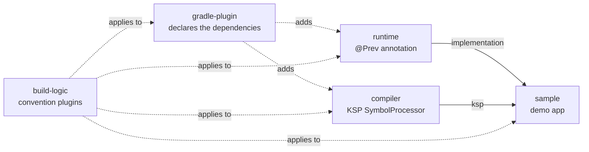

# Architecture

## Goal

PrevHam eliminates repetitive Jetpack Compose `@Preview` boilerplate. A developer annotates a
`@Composable` function with `@Prev`; at compile time, PrevHam analyzes the function's parameters,
generates mock values for each supported type, and emits a `@Preview @Composable` wrapper function
that calls the original composable with those mocks.

Two constraints shape every design decision in this project:

- **All Preview and mock generation happens at compile time.** Nothing runs when the app is running.
- **No runtime reflection.** Type information comes exclusively from KSP's compile-time symbol model
  (`KSType`, `KSClassDeclaration`, ...), never from `kotlin.reflect` or `java.lang.reflect`.

## Module structure



| Module | Responsibility | Constraints |
|---|---|---|
| [`runtime`](../runtime) | Defines the `@Prev` annotation. The only public API library users depend on. Published as `io.github.parkjiminnnn:prevham-runtime`. | No codegen logic. Minimal dependencies. Must stay lightweight and stable, since it's the one artifact consumers compile against directly. Deliberately a plain Kotlin/JVM library, not an Android library — see [Why `runtime` isn't an Android library](#why-runtime-isnt-an-android-library). |
| [`compiler`](../compiler) | Implements the KSP `SymbolProcessor` that finds [`@Prev`](prev-annotation.md)-annotated functions, generates mock values, and emits Preview source via KotlinPoet. Published as `io.github.parkjiminnnn:prevham-compiler`. | All codegen is compile-time only. No runtime reflection. Output must be deterministic. Mock generation is split into small, independently testable components (see [mock-generation.md](mock-generation.md)). |
| [`sample`](../sample) | A real Android app that exercises every supported feature. Demo composables live in [`showcase/`](../sample/src/main/java/io/github/parkjiminnnn/prevham/showcase), one file per mock-generation category, and `MainActivity` renders them all with hand-written arguments — so the app screen and the IDE's Preview pane show the same composables side by side, one with real data and one with generated mocks. Doubles as a verification project: if a `@Prev`-annotated composable in `sample` doesn't produce a compiling Preview, something in `compiler` is broken. | — |
| [`gradle-plugin`](../gradle-plugin) | A Gradle plugin (`io.github.parkjiminnnn.prevham`) that declares `runtime`, `compiler` and MockK for consumers, at its own version. Published as `io.github.parkjiminnnn:prevham-gradle-plugin`, together with the plugin marker `plugins { id(...) }` resolves. | Deliberately does **not** apply KSP: a KSP version is tied to a Kotlin version, so applying it would pin the consumer's Kotlin to PrevHam's. The KSP Gradle plugin is `compileOnly` so it never reaches a consumer's buildscript classpath, and the plugin fails with an actionable message when KSP is absent. Covered by Gradle TestKit, which runs real builds rather than asserting on Gradle objects. |
| [`build-logic`](../build-logic) | Gradle convention plugins (`prevham.kotlin.jvm`, `prevham.android.application`, `prevham.ksp`, `prevham.ktlint`, `prevham.publishing`) shared across modules. | Centralizes Kotlin/AGP/KSP versions, lint, and Maven Central publishing configuration in one place. |

## Dependency direction

`sample`'s `build.gradle.kts` is the only place the three functional modules meet:

```kotlin
dependencies {
    implementation(project(":runtime"))
    ksp(project(":compiler"))
}
```

Notably, **`compiler` does not depend on `runtime` at all** — there is no `implementation(project(":runtime"))`
in `compiler/build.gradle.kts`. `compiler` never imports the `Prev` annotation class. Instead, it asks
the KSP `Resolver` for symbols by the annotation's fully-qualified name as a plain string:

```kotlin
resolver.getSymbolsWithAnnotation("io.github.parkjiminnnn.runtime.Prev")
```

This keeps `compiler` fully decoupled from `runtime` at compile time — a real compile dependency would
be circular in spirit (the annotation processor "depending on" the thing it processes) and would tie
`compiler`'s build to `runtime`'s. The string-based lookup is the same mechanism used throughout KSP
processors for this reason. See [ksp-processing.md](ksp-processing.md) for how the annotation's own
arguments are then read back out via `KSAnnotation`, still without a compile dependency on `runtime`.

## Why `runtime` isn't an Android library

Despite PrevHam being an Android-focused library, `runtime` is published as a plain Kotlin/JVM
**JAR**, not an Android **AAR**. An AAR only earns its keep when a module ships something
Android-specific — Android APIs, resources (`res/`), real `AndroidManifest.xml` declarations, or
consumer ProGuard rules. `runtime` has none of these: it contains exactly one file, `Prev.kt`,
which references no `android.*` or `androidx.*` type.

The deciding factor is `@Prev`'s retention:

```kotlin
@Retention(AnnotationRetention.SOURCE)
annotation class Prev(...)
```

`SOURCE` retention means the annotation is discarded at compile time — it never reaches the
bytecode, let alone the Android runtime. KSP reads it during compilation and that's the end of its
life. There is no runtime for it to interact with, so nothing about it can be Android-specific.

Android apps consume the JAR without any special handling: the Android build pipeline converts JVM
bytecode to DEX via D8/R8, and it makes no difference whether those classes arrived in a JAR or
inside an AAR's `classes.jar`. Publishing a JAR also makes `runtime` usable from non-Android JVM
projects.

## Why compile-time only

Because every mock value and every `@Preview` function is materialized as real Kotlin source during
the KSP step, the generated code is:

- **Visible and debuggable** — it's a normal `.kt` file under `build/generated/ksp/...`, not something
  synthesized at class-load time.
- **IDE-friendly** — Android Studio's Compose Preview renderer sees an ordinary `@Preview @Composable`
  function; it needs no special-casing to run it.
- **Zero runtime cost** — no reflection, no annotation scanning, no proxies ship in the compiled app.

The tradeoff is that everything `compiler` does must be derivable from the KSP symbol graph alone
(`KSType`, `KSClassDeclaration`, `KSFunctionDeclaration`, ...) at the point the function is compiled —
it cannot inspect actual runtime values, since none exist yet.

## API stability policy

`runtime`'s public API is intentionally minimal: the `@Prev` annotation and its three parameters
(`darkMode`, `locales`, `fontScales`). Since `runtime` is the only artifact library users compile
against directly, changes here follow semver, under this policy:

- **New `@Prev` parameters must have a default value.** Every existing `@Prev` usage in a consumer's
  codebase must keep compiling and behaving identically after upgrading, without any changes on
  their part.
- **Existing parameter names, types, and defaults are not renamed or changed** once published,
  except in a major version bump.
- **`compiler`'s internals are not part of the public API contract.** Everything in `compiler` other
  than `PrevSymbolProcessorProvider` (needed for KSP's `SymbolProcessorProvider` service lookup) is
  `internal`, and consumers never interact with `compiler`'s classes directly — only through the KSP
  plugin mechanism (`ksp(project(":compiler"))` / `ksp("io.github.parkjiminnnn:prevham-compiler:...")`).
  This means `compiler`'s internals can be freely refactored without being a breaking change, as long
  as the generated Preview code's *behavior* for a given `@Prev` usage doesn't change.
